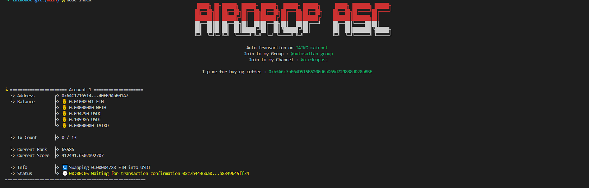

# 🚀 TAIKO BOT

---

## 📜 Description

**TAIKO BOT** Bot of token exchange on TAIKO chain izumiswap, supporting eth->usdc, eth->usdt, eth->taiko, usdc->weth, usdt->weth, taiko->weth exchange, auotomaticaly approve and unapprove, unwrap weth>eth

---

## ✨ Key Features

- 🔄 **Multi-Token Support**: Swap between various ERC-20 tokens on the TAIKO network.
- ⚡ **Speed Optimization**: Fast execution of swaps to capitalize on market opportunities.
- ✨ **Support Multy account**: Fast execution of swaps to capitalize on market opportunities.

## 📦 Installation

To set up the Automated Swap feature, follow these steps:

1. **Clone the repository**:
   `bash git clone https://github.com/alexswanFantom/taikobot.git`

2. **Navigate to the project directory**:
   `cd taikobot`

3. **Install dependencies**:
   `npm intall or yarn install`

4. **Set up environment variables**: go to settup.js add your wallet private key :
   `static privateKey = [""]`

5. **Run the application**:
   `node index.js`

## 📖 Usage

To use the Automated Swap feature, follow these steps:

1. Configure your wallet: Ensure your wallet is connected and properly configured.
2. Set Parameters: Set the amount and any other parameters for the swap on settup.js.
3. Execute Swap: Call the swap function to execute the trade.

## 📬 Contact

`Join to my channel`: t.me/airdropasc

## 🎉 Support me

`Tip me for buying coffee : 0xbfA6c7bF6dD515B5200d6aD65d729838dD20aBBE`
